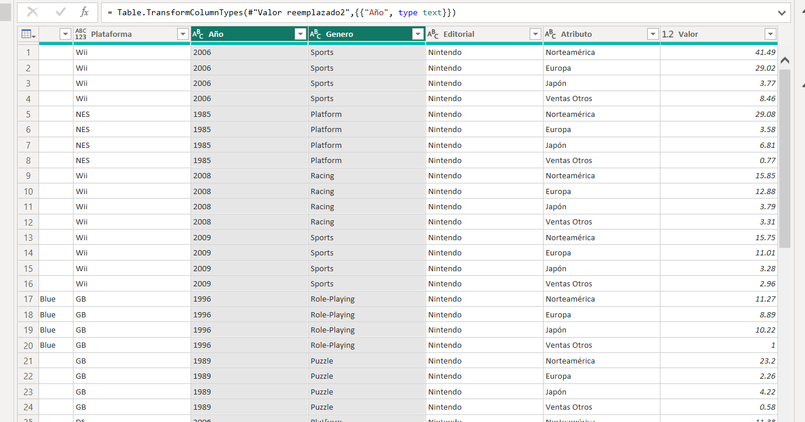

# Dashboard_VideoJuegos
Este proyecto se basa en datos publicos de la industria de videojuegos que tiene las siguientes dimensiones:

1.- Año

2.- Region

3.- Editorial

4.- Genero

5.- Plataforma

6.- Nombre

Como medida se tiene la cantidad de copias vendidas.

# Herramienta de desarrollo
Se utilizó Power BI para la transformación de datos generando solamente una tabla con los datos de los videojuegos
Una opción destacable de power bi es :
La Anulación de dinamización de columnas lo cual permite pasar de columnas a filas como se muestra en las siguientes imagenes
Antes

Despues

La opción en power bi se encuentra en transformación de datos

Llegando al siguiente informe en power bi

# Conclusiones
Con la opción de anulación de dinamización de columnas podemos crear una dimensión y transformamos los datos de una manera sencilla y efectiva para poder analizar los datos.
Respecto el Informe se desarrollo con filtros los cuales nos ayudan a ver las copias vendidas por año, por genero, editorial y plataforma.

